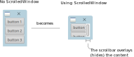

## Introduction

*Goal*: 
Create a window, that would automatically show a vertical scrollbar (up/down),
if its content is vertically too long.

*Pitfalls:* 
The default behavior for a GtkScrolledWindow is, scrollbars don't not reserve
space for themselves. They *overlay* - and possibly hide - the content (see image below).

## Code

- [`main_1_default.c`](./main_1_default.c) shows the default approach of using a
  `GtkScrolledWindow`.

- [`main_2_nonOverlaying_scrollbar.c`](./main_2_nonOverlaying_scrollbar.c)
    implements a function, that will create a scrollable widget with a
    scrollbar, that would never overlay it's content. 
    
